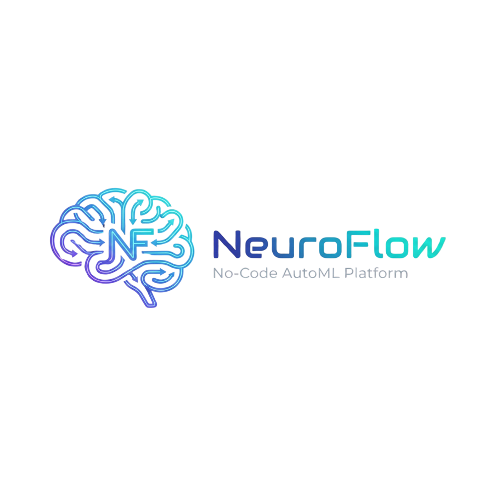

<div align="center">
  
</div>

# 🧠 NeuroFlow

**NeuroFlow** is a modern, no-code **AutoML platform** that empowers users to build, train, and deploy machine learning models without writing a single line of code. Built with Next.js and Python, NeuroFlow provides an intuitive interface for data scientists, analysts, and ML enthusiasts to perform end-to-end machine learning workflows.

---

## ✨ Features

- 🎯 **No-Code ML Pipeline**
- 📊 **Comprehensive Data Preprocessing**
- 🤖 **Multiple ML Algorithms**
- 📈 **Advanced Visualizations**
- 🔮 **Real-Time Predictions**
- 🎨 **Beautiful UI/UX**

---

## 🛠️ Tech Stack

### Frontend
- **Next.js 14** 
- **TypeScript** 
- **Tailwind CSS** 
- **Radix UI** 
- **React Icons**

### Backend
- **Python 3.9+** 
- **scikit-learn** 
- **pandas**
- **NumPy**
- **Matplotlib & Seaborn**
- **joblib**

---

## 🚀 Installation

### Prerequisites
- **Node.js** 18+ and npm/yarn
- **Python** 3.9+
- **MongoDB** (local or Atlas)

### 1. Clone the Repository
```bash
git clone https://github.com/visionjain/NeuroFlow
cd NeuroFlow
```

### 2. Install Dependencies
```bash
# Install Node.js dependencies
npm install

# Python packages are auto-installed when running ML scripts
```

### 3. Environment Setup
Create a `.env` file in the root directory:
```env
MONGO_URI=your_mongodb_connection_string
TOKEN_SECRET=your_jwt_secret_key
DOMAIN=http://localhost:3000
```

### 4. Run Development Server
```bash
npm run dev
```

Open [http://localhost:3000](http://localhost:3000) in your browser.

---

## 📖 Usage

1. **Sign Up / Login** - Create an account or log in
2. **Create Project** - Name your ML project and select algorithm
3. **Upload Data** - Upload training (and optionally test) CSV files
4. **Configure Pipeline**:
   - Select features and target variable
   - Choose preprocessing techniques
   - Configure model hyperparameters
5. **Train Model** - Click "Run Training" and monitor real-time logs
6. **Analyze Results** - View metrics, results, and visualizations
7. **Make Predictions** - Use trained models for instant predictions

---

## 🎯 Supported Algorithms

### Currently Available
- ✅ **Linear Regression**
- ✅ **Logistic Regression**
- ✅ **K-Nearest Neighbors (KNN)**

---

## 🤝 Contributing

Contributions are welcome! Please feel free to submit a Pull Request.

---

## 📄 License

This project is licensed under the MIT License.

---

## 👤 Author

**Vision Jain**
- GitHub: [@visionjain](https://github.com/visionjain)

---

## 🙏 Acknowledgments

Built with ❤️ using modern web technologies and open-source ML libraries.

---

**NeuroFlow** - *Making Machine Learning Accessible to Everyone* 🚀
